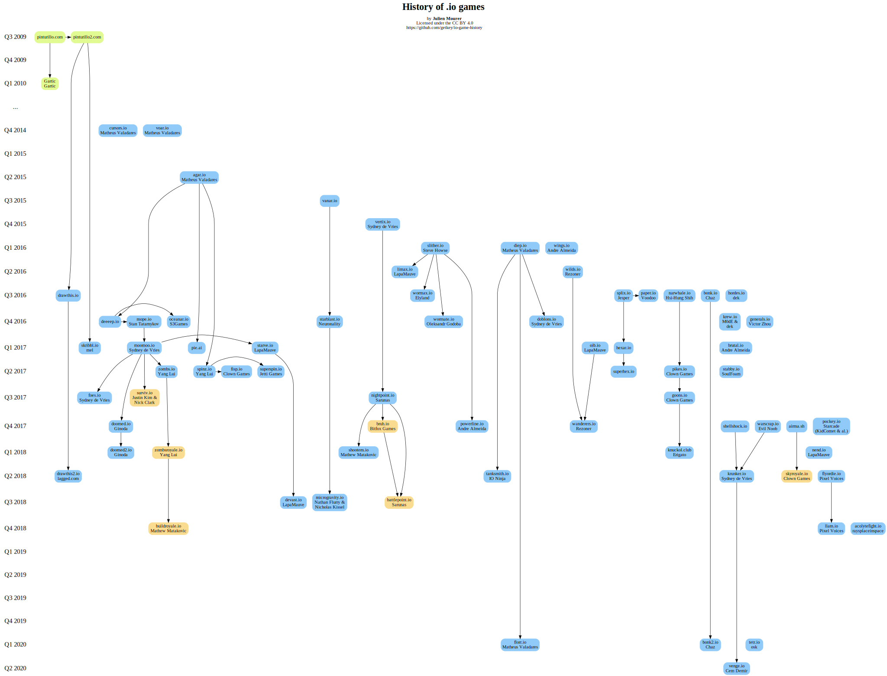
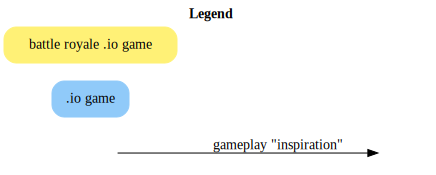

# .io game history




This is a graph of the evolution of io games.
Note that for simplicity sake, I am considering the games as they were at release. And by release I mean when they are publicly available on the web, even if the developer considers it "alpha" or "beta".

Arrows represent **gameplay** "inspirations". Most of these are extrapolated, so please take them with a grain of salt.
If you think I am mistaken about a relationship, please open an issue or a PR. However, since this is quite open to interpretation, unless you have some hard fact I may disagree with you and not change it.

I used the [Wayback Machine](https://web.archive.org/) or publicly available data to determine release dates. Please open an issue or a PR if a date is wrong, with a source such as a Wayback Machine entry or a release tweet by the creator.

This graphic is by no mean complete. Please submit a PR if you want to add a game.
But for now:

- Please do not submit very small games, as I would like to keep this graph readable. I will think of a way to include more of them later.
- Please do not submit games from the current quarter.

**Please submit only one PR/open one issue per change so they can be discussed individually.**

## How to generate this graph

Install [Graphviz](https://www.graphviz.org/).

```sh
dot -Tsvg io-game-history.gv > io-game-history.svg
dot -Tsvg legend.gv > legend.svg
```

## License

[](http://creativecommons.org/licenses/by/4.0/)
