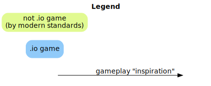

# .io game history




This is a graph of the evolution of .io games. It was inspired by [this diagram of the NetHack variants](https://nethackwiki.com/wiki/File:VariantHistoryGraph.jpg).

Note that for simplicity sake, I am considering the games as they were at release. And by release I mean when they are publicly available on the web, even if the developer considers it "alpha" or "beta".

Arrows represent **gameplay** "inspirations". Most of these are extrapolated, so please take them with a grain of salt.

## Methodology

To determine release dates, I mainly used the [Wayback Machine](https://web.archive.org/). Sometimes I used other public sources such as YouTube footage or Tweets. I also asked some creators directly.

## Contribute

This graphic is by no means complete. Please submit a PR if you want to add a game or correct something.

**Please submit one PR/issue per change so each can be discussed individually.**

### Adding games

- Please do not submit prototypes and very small games unless they have historical significance. I would like to keep this graph readable.
- Please do not submit games from the current quarter. This graph is a historical record, not free advertising for your game.

### Fixing dates

Provide a source such as a Wayback Machine entry or a release tweet by the creator.

### Fixing relationship

I might have been mistaken when I determined the relationship. But this is quite open to interpretation. So please provide you have some hard fact to back up your claim.

## How to generate this graph

Install [Graphviz](https://www.graphviz.org/).

```sh
dot -Tsvg io-game-history.gv > io-game-history.svg
dot -Tsvg legend.gv > legend.svg
```

## License

[](http://creativecommons.org/licenses/by/4.0/)
